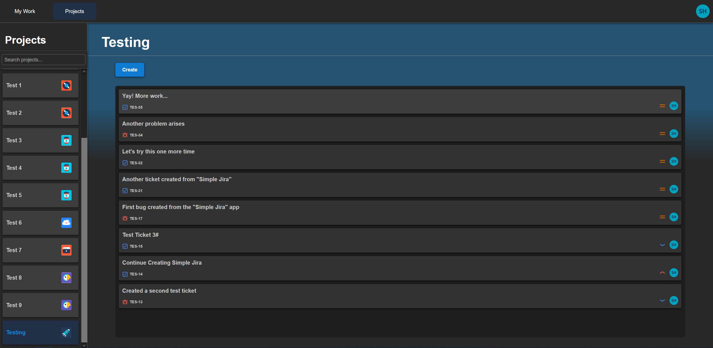
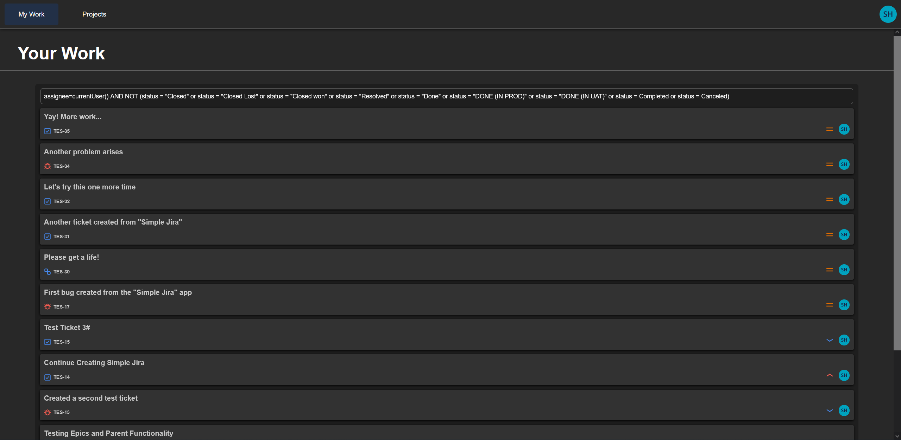
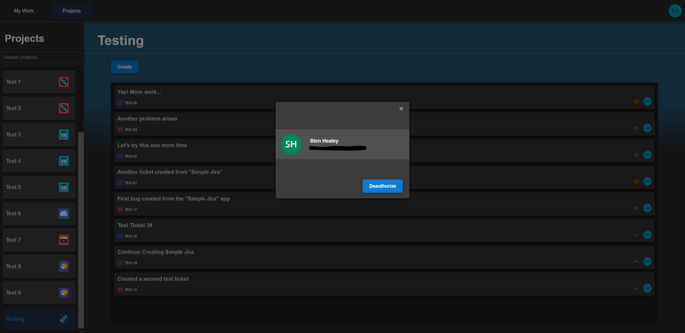
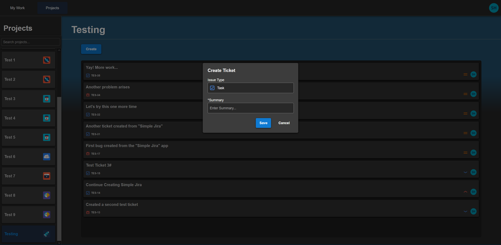
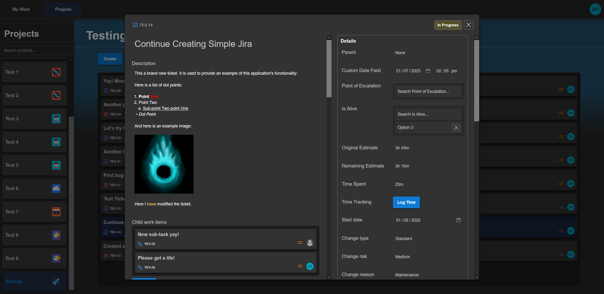
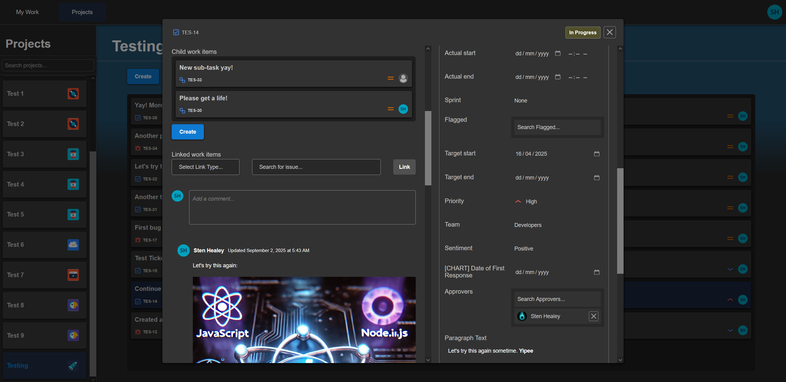
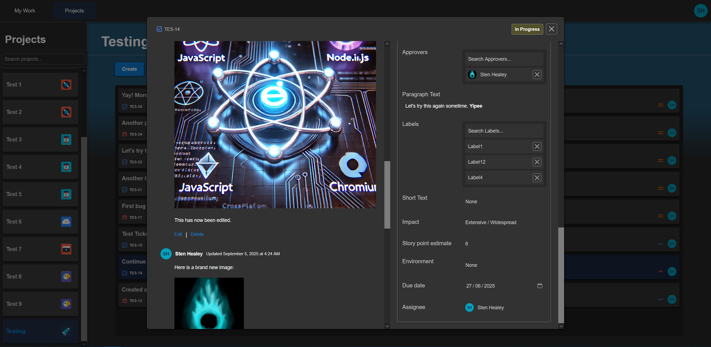
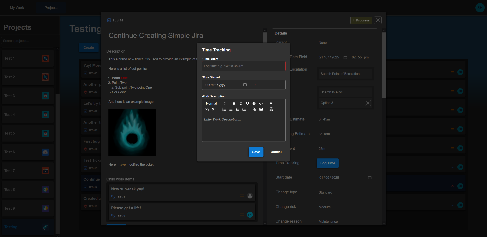

# Ticket Mirror

**Author:** Sten Healey


### **Description**
The goal has been to develop an application where users can access, edit and create tickets from Jira. More broadly this project is intended to be sufficiently modular that developers can customize and extend it to the needs of their specific business. Furthermore, a feature has been added wherein a Jira Service Account can "proxy" access to the Jira API (note this is in addition to the Jira login feature). This feature has already been implemented (see settings/Service Account Authorization). Please see a preview of the interface below. 


### **Pre-requisites**

1. Node.js must be installed on your device.

2. An active Jira account.


### **Setup**

1. After downloading this repository navigate to the path `C:/../../Jira Ticket Editor/Jira Ticket Editor>`

2. Please setup a Jira OAuth 2.0 application via the [Jira Developer Console](https://developer.atlassian.com/console/myapps/)

3. Please add a file named `.env` containing the following information

```txt

ENVIRONMENT=development
CLOUD_ID=<your atlassian cloud ID>
CLIENT_ID=<your jira client id>
CLIENT_SECRET=<your jira client secret>
SALT=<sha512 compatible salt>

```

4. Before running please run the command:

```shell
npm install
```


### **Dev Run**

To run the Next.js application please run the command(s):

```shell
npm run dev
```


### **Prod Run**

To run the Next.js application please run the command(s):

```shell
npm run build
```

```shell
npm run start
```


### **Additional Setup & Notes**

* In order to add a service account please follow the following steps:

  1. Follow the [instructions](https://support.atlassian.com/user-management/docs/manage-api-tokens-for-service-accounts/) provided by Jira to create a scoped API Key with the following scopes:
      - read:jira-work
      - read:jira-user
      - read:servicedesk-request
      - write:jira-work
      - write:servicedesk-request
      - manage:jira-project
      - manage:jira-configuration
      - manage:jira-webhook
      - manage:jira-data-provider
      - manage:servicedesk-customer

  2. Authorize the application using the Service Account email address and API Key, via the "Settings" feature.


### **Completed Features**

- Jira API Proxying

- OAuth 2.0 Login

- Logout

- Layouts (Navbar etc)

- Settings & Service Account Authorization

- Searchable Project List

- Simplified Project Ticket List

- User's Assigned Ticket List

- Ticket creator

- Ticket Fields/Components:
  - Date Input
  - Date Time Input
  - Issue Type Input
  - Label(s) Input
  - Number Input
  - Single-Option Input
  - Multi-Option Input
  - Parent Issue Input
  - Priority Input
  - Rich Text (ADF) Input
  - Sentiment Input
  - (Un-formatted) Text Input
  - Sprint Input
  - Status Input
  - Team Input
  - Worklog Input
  - Multi-User Input
  - Single-User Input
  - Ticket worklogs
  - Ticket sub-tasks
  - Ticket comments
  - Ticket Links


### **Preview**


**Project Board**


**User's Tickets**


**Settings / Service Account Authorization**


**Creating a Ticket**


**Ticket Interface**




**Worklog**


> [!Warning]
> In utilizing this repository you acknowledge that you take full responsibility in ensuring that it is utilized in accordance with Jira's Terms of Service and all relevant legislation in your region.